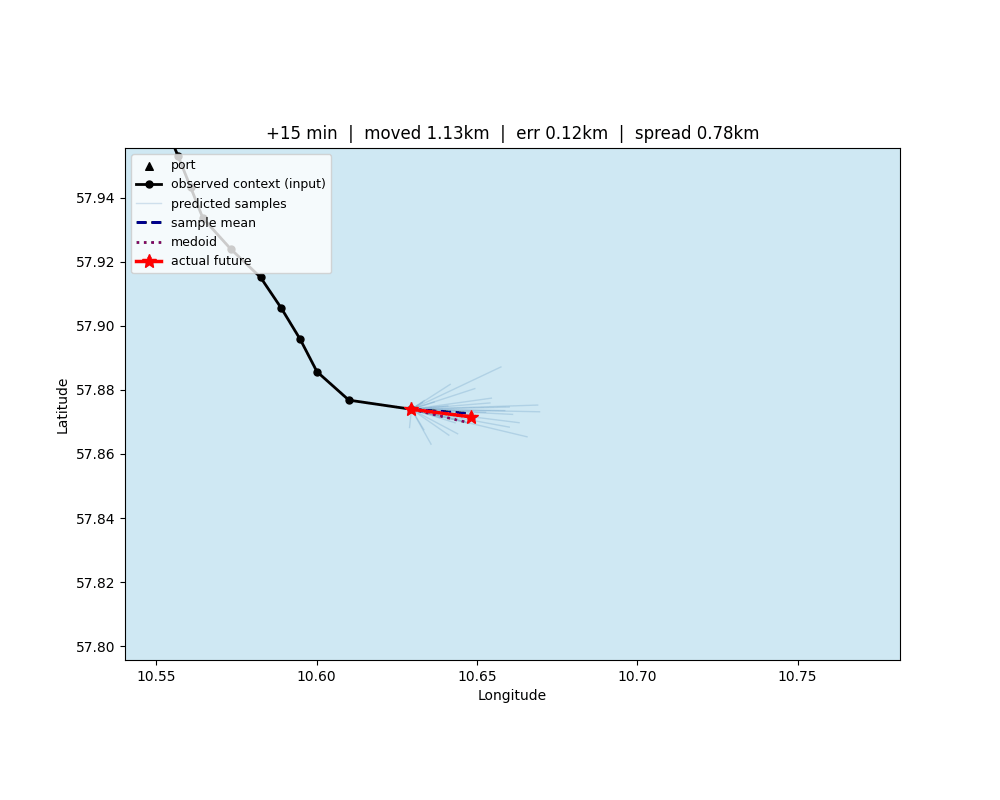

# Maritime Vessel Trajectory Prediction

Forecasts where a vessel will be, from its recent AIS track, the traffic
around it, and the surrounding coastline and ports — as a **distribution
of plausible futures** rather than a single point estimate.



*Black: observed track fed to the model. Blue: sampled predicted futures.
Red: what actually happened. Dashed/dotted: the sample mean and medoid.*

## Approach

The architecture follows DeepMind's weather-forecasting lineage:

- **GraphCast** — a triangulated spatial mesh with graph-neural-network
  message passing, and predicting a **residual** from the last known
  state rather than an absolute position.
- **WeatherNext FGN** — a sampling head that emits many trajectories per
  forward pass, trained with an energy score loss so the spread of
  samples carries real information about uncertainty.

Predicting normalized residual displacement rather than absolute
coordinates was the single largest improvement in the project: it took
the correlation between predicted uncertainty and actual movement from
roughly zero to 0.72.

Domain: Danish waters, using the Danish Maritime Authority's public AIS
archive.

## Pipeline

1. **Mesh** (`mesh.py`) — Delaunay triangulation over the domain, denser
   near coastlines and ports. Nodes carry `[lon, lat, is_land, is_port]`.
2. **Per-timestamp graph** (`graph_data.py`) — mesh nodes plus every
   vessel present, with vessel↔mesh and vessel↔vessel k-NN edges. One
   graph per timestamp, **shared across all ego vessels** (see Notes).
3. **GNN encoder** (`model.py`) — two heterogeneous `SAGEConv` layers.
4. **Cached causal transformer** (`cached_attention.py`) — full-window
   pass for training, incremental KV-cached `.step()` for streaming.
5. **FGN head** (`model.py`) — context + noise → many sampled
   trajectories.

## Results

Held-out vessels (never trained on), 12 days of AIS, 60-minute forecast:

| metric | value |
|---|---|
| spread ↔ displacement correlation | 0.753 |
| mean error (moving vessels) | 5.37 km |
| beats persistence baseline | 82.4% |

**On baselines:** two are reported. *Persistence* assumes the vessel
stays put, so its error equals however far the vessel actually moved —
an easy bar. *Constant velocity* (dead reckoning) extrapolates the last
observed velocity, and is genuinely hard to beat because ships mostly
travel in straight lines. Failure analysis found turning is by far the
dominant error driver (worst-vs-best window turn angle ratio of 4.0),
which is consistent with the model doing something close to linear
extrapolation. **Read `beats_const_velocity_pct`, not
`beats_persistence_pct`.**

## Setup

```bash
python3 -m venv venv && source venv/bin/activate
pip install torch==2.9.1 --index-url https://download.pytorch.org/whl/cu128
pip install -r requirements.txt
```

Three data inputs, none in the repo:

```bash
# coastline
mkdir -p data/ne_10m_land && cd data/ne_10m_land
wget https://naciscdn.org/naturalearth/10m/physical/ne_10m_land.zip && unzip ne_10m_land.zip

# ports: data/ports_denmark.csv with columns name,lon,lat

# AIS (~2 GB/day) -- keep on scratch, not home
wget http://aisdata.ais.dk/aisdk-YYYY-MM-DD.zip && unzip aisdk-YYYY-MM-DD.zip
```

## Usage

```bash
python3 train.py \
    --ais-glob "/scratch/$USER/maritime/ais/aisdk-*.csv" \
    --n-underway 300 --n-stationary 300 \
    --seq-len 12 --future-len 4 \
    --hidden 128 --n-layers 4 \
    --batch-size 32 \
    --n-epochs 60 \
    --checkpoint-path checkpoints/model.pt
```

Evaluation and figures, from a notebook:

```python
import viz

ctx = viz.setup(n_underway=300, n_stationary=300, seq_len=12)
model, norm_scale, meta = viz.load_checkpoint_model('checkpoints/model.pt')

viz.evaluate(model, ctx.combined_val, norm_scale)        # both baselines
viz.per_step_errors(model, ctx.combined_val, norm_scale) # error vs horizon
viz.plot_grid(model, ctx.combined_val, norm_scale, ctx)  # moving + stationary
viz.animate_prediction(model, ctx.combined_val, 0, norm_scale, ctx)

records = viz.analyze_failures(model, ctx.combined_val, norm_scale, ctx)
viz.summarize_failures(records)                          # what drives errors
```

Pass the same `n_underway` / `n_stationary` / `val_seed` the training run
used — `setup` reproduces the train/val split to keep evaluation on
genuinely held-out vessels, and mismatched parameters silently mix in
vessels the model trained on.

## Branches

- **`main`** — fixed 15-minute resampling. Interpolates across single
  gaps; every forecast is exactly 60 minutes ahead.
- **`irregular-sampling`** — raw AIS pings, no resampling or
  interpolation. Elapsed time is an explicit feature, attention is
  encoded over real seconds rather than step index, and the head is
  conditioned on each target's Δt so it can be queried at arbitrary
  horizons. Motivated by measurement: per-vessel median ping intervals
  span 10 s to 284 s, a 28× range that fixed binning hides. Slightly
  behind on accuracy so far, but it is the version that could run on a
  live AIS stream.

## Notes

- **World snapshots are shared across ego vessels.** The world at a
  timestamp does not depend on which vessel you are forecasting — only
  the choice of ego row does. Building one graph per *(vessel,
  timestamp)* pair duplicated the same graph hundreds of times; sharing
  measured an 856× memory reduction and is what made multi-day runs
  possible.
- **Stationary vessels are sampled, not excluded.** A deployed predictor
  has to handle "stays put" as a valid outcome.
- **Train/val splits are by vessel, not by window.** Windows from one
  vessel overlap heavily, so a window-level split would leak.
- **Known issue:** batched training intermittently triggers a CUDA
  device-side assert inside `encode_windows_batched`. Setting
  `CUDA_LAUNCH_BLOCKING=1` avoids it at some throughput cost;
  `--resume` makes an interrupted run cheap to continue. Unresolved.

## Files

```
mesh.py               spatial mesh construction
coastline.py           coastline/port loading, domain bounds
ais_ingest.py          AIS parsing, resampling, vessel selection
ais_cache.py           disk cache for the load+resample stage
graph_data.py          graph construction, windowed dataset
cached_attention.py    KV-cached causal transformer
model.py               GNN + transformer + FGN head
losses.py              energy score loss
batching.py            batched window encoding with snapshot dedup
train.py               training entry point
inference.py           multi-step rollout
viz.py                 evaluation, plots, animations, failure analysis
slurm/                 batch scripts
```